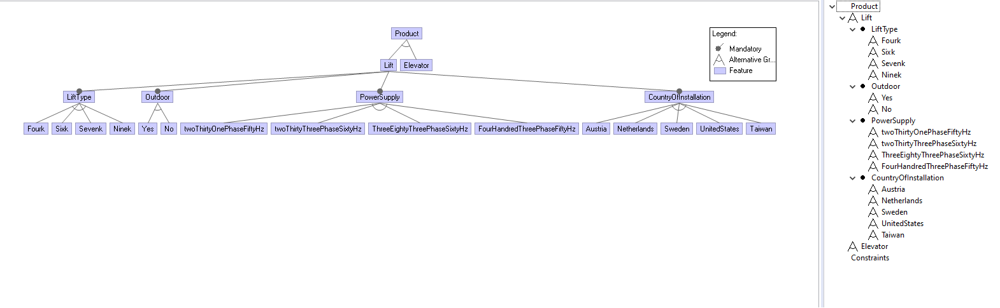

# SimpleConfigurator
Automated Configurator project. The frontend is developed on React.js. The backend is developed on ASP.NET. 




# System Design and Architecture
The project is developed in an object-oriented manner as 2 different microservices (the backend project and the frontend project). The communication is defined by the REST API that is provided by the webservice controller in the backend. 

## Backend - Top down
  - ConfigController
    - is the simaple main controller that provide DataToSend endpoint via Get request. 
    - CORS is enabled exclusivly for the frontend origin with port 3000. 
  - Model
    - Entities: generated classes from the given database, handled by using ConfiguratorDataModel class that has object of all of these entities.
    - Business logic: Here the data of the products and their parameters as well as the rules and their parameters are gathered and formed in a way that maximizes the performance of handling it by the frontend.
      - RulesHandler: The most interesting part, this class uses GenericDAO and models the rules, parameters and values to inner classes and forms them to constraints with 2 parameters or with 3 parameters in a way that make it easy and with high performance to handle the data in the frontend. 
      - ProductHandler: uses GenericDAO to gather the data of the parameters saved in Dictionary<string, Dictionary<int, string>> Parameters;
      - DataToSend: has both 
      ```
      Dictionary<string, Dictionary<int, string>> Parameters;
      List<List<int>> ConstraintsList;
      ```
      which will be converted to Json object and sent as a response to the frontend call via the endpoint in the controller.
      
      The sent data has the following form:
      ```
      {
        "Parameters": {
          "Lift type": {
          "1": "4000",
          "2": "6000",
          "3": "7000",
          "4": "9000"
          },
          "Outdoor": {
          "5": "Yes",
          "6": "No"
          },
          "Power supply": {
          "7": "230 V, 1-phase, 50 Hz",
          "8": "230 V, 3-phase, 60 Hz",
          "9": "380 V, 3-phase, 60 Hz",
          "10": "400 V, 3-phase, 50 Hz"
          },
          "Country of installation": {
          "11": "Austria",
          "12": "Netherlands",
          "13": "Sweden",
          "14": "United States",
          "15": "Taiwan"
          }
        },
        "ConstraintsList": [
          [2,5],
          [4,5],
          [7,14],
          [7,15],
          [10,14],
          [10,15],
          [8,11],
          [8,12],
          [8,13],
          [9,11],
          [9,12],
          [9,13],
          [1,9]
          ]
        }
        ```
        The each sublist of length 2 in ConstraintsList indicates to the frontend that its elements are mutually excluded. For example, [2,5] says that the fifth radio button must be disabled when the second one is marked and vice versa.
  - DAO
    - GenericDAO is part of Model package but is separated in its functionality from the entities.
    - Its main work is to handle the data base and provide the business logic classes the needed data from the data base by proper functionality.

## Frontend
  - Single page application design where the pages share the nav-bar and the footer.
  - The routing is done centrally and relativly in App.js
  - The code is written as components and composite componenets.
  - The main-page shows the product alternatives using React Material Design cards.
  - The Nav-bar is done using React Bootstrap.
  - The Containers are flexboxes using React Bootstrap.
  - When you click on Lift, then Lift-component sends get request to the backend to get the data and save it in its state. 
  - Lift-component loopes over the gotten parameters and creates ListGroupItem component for each one that render the title of the radio-buttons-block.
  - Each ListGroupItem component creates RadioItem component that render shows the radio buttons with there labels.
  
  
  # The project's strengths 
  ## Scalability and automation
  You can now simply just extend the database with arbitrary number parameters to build radio buttons for and constraines in form of disallowed-rules, and the application will render them automatically and do all the checks automatically without adding one if statement or any row of code.
  ##  Performance
  The frontend is fetching the database through the backend **just one time** when a product will be reviewed, and all the checks are done locally based on the constraintsList that is sent from the backend in form of small arrays that also enhances the performance of reading from and handling the constraints. 
  ##  Separation of concerns 
  Object-oriented principle SRP is clearly followed. Additionally No circular dependencies.
  ## Extra-task
  The program now is able to solve constraints with 2 and 3 parameters. I thought of that it may not be so often one get more than 3 mutually excluded parameters. The handling of 3 parameters is done in both the backend and the frontend.  

